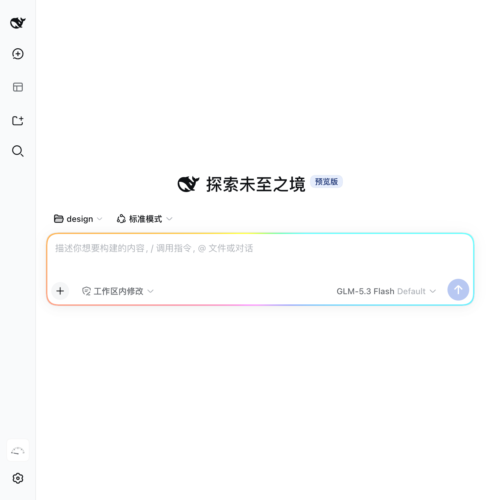
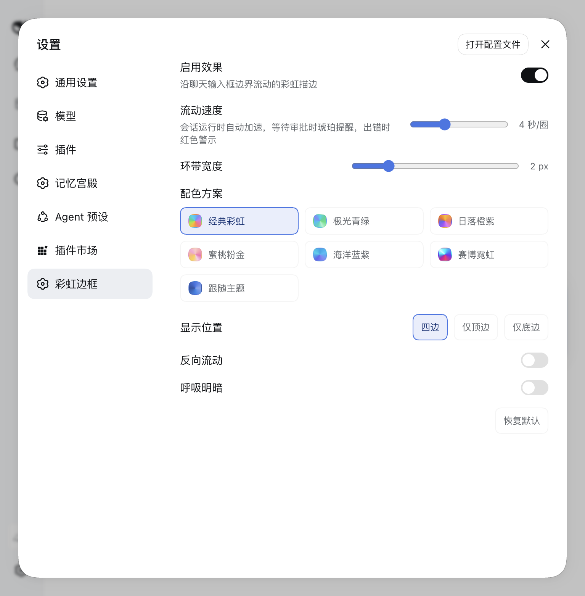
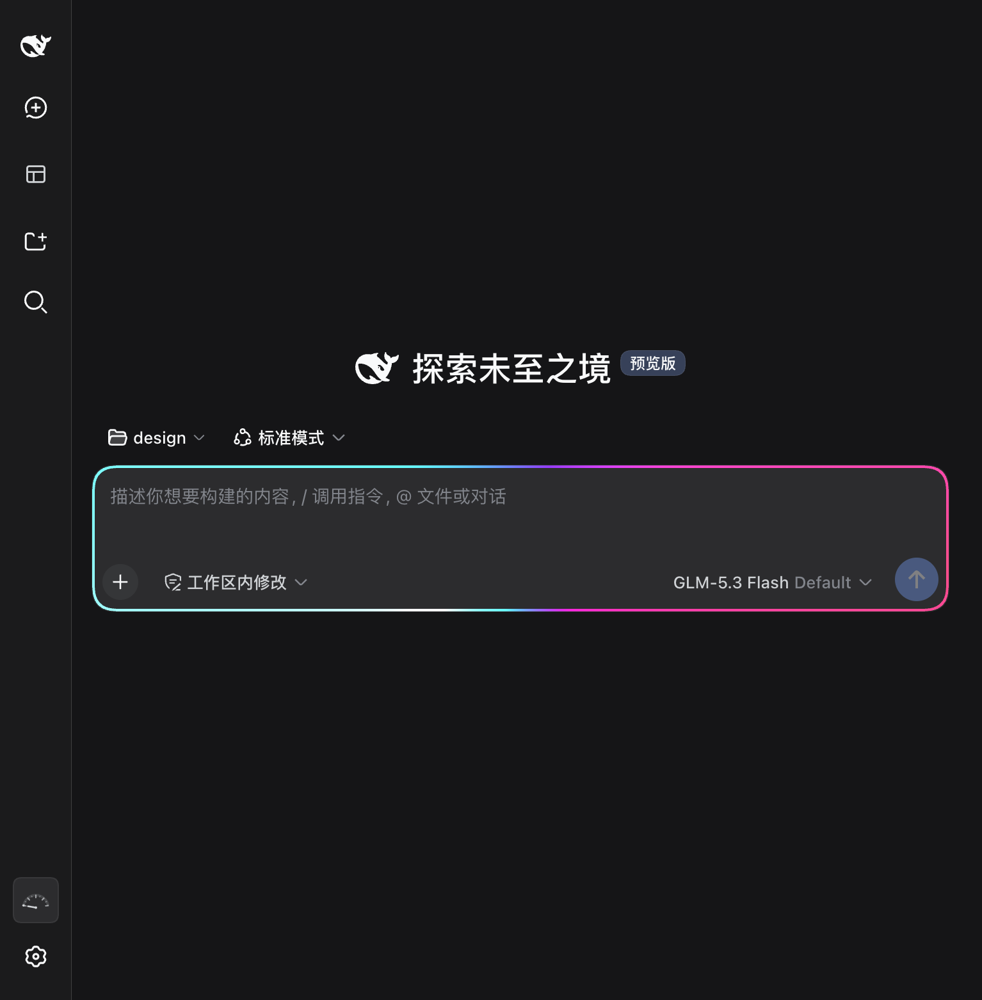
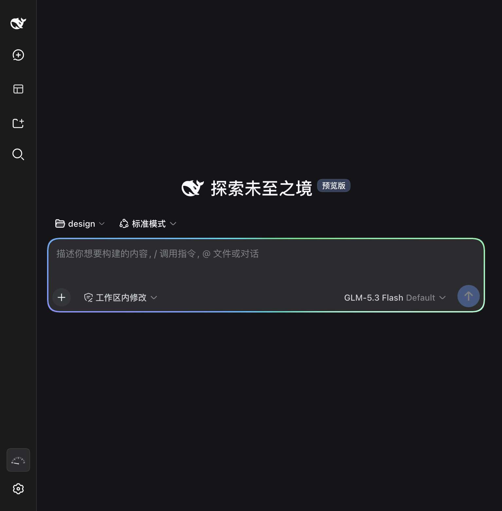
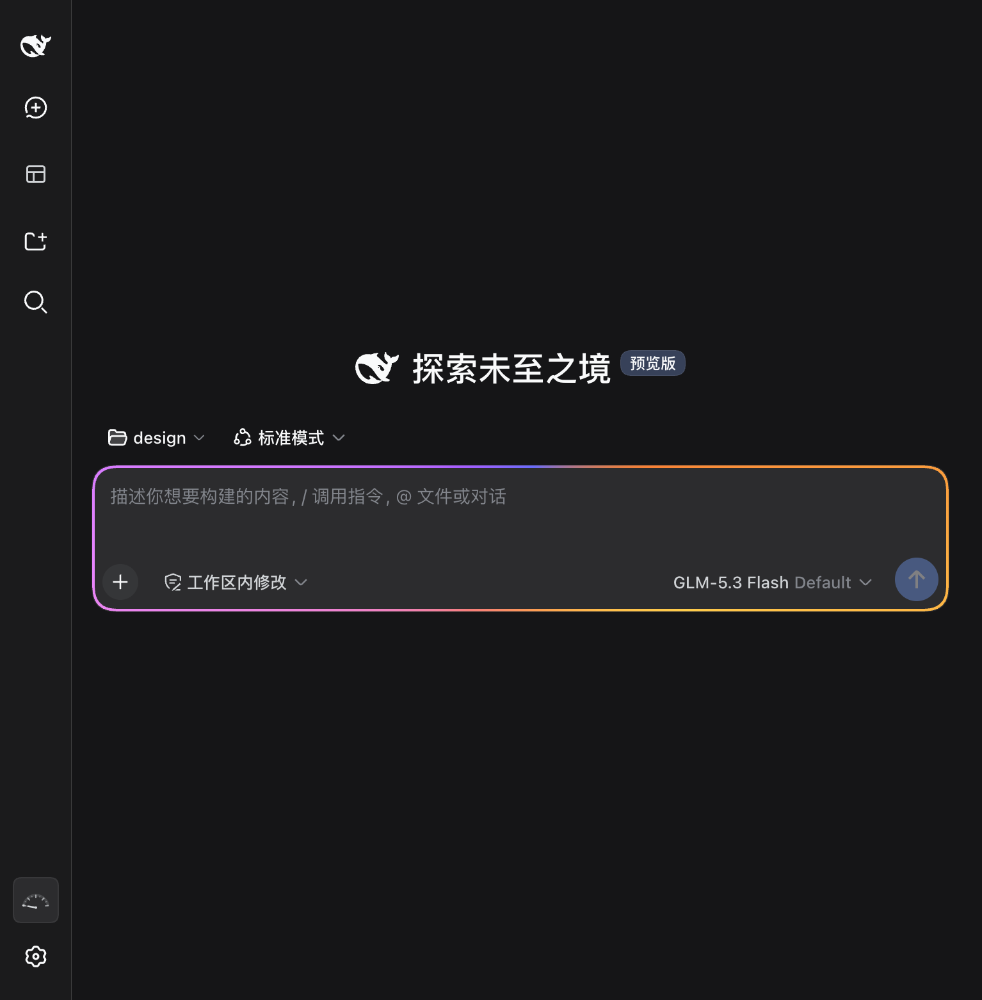
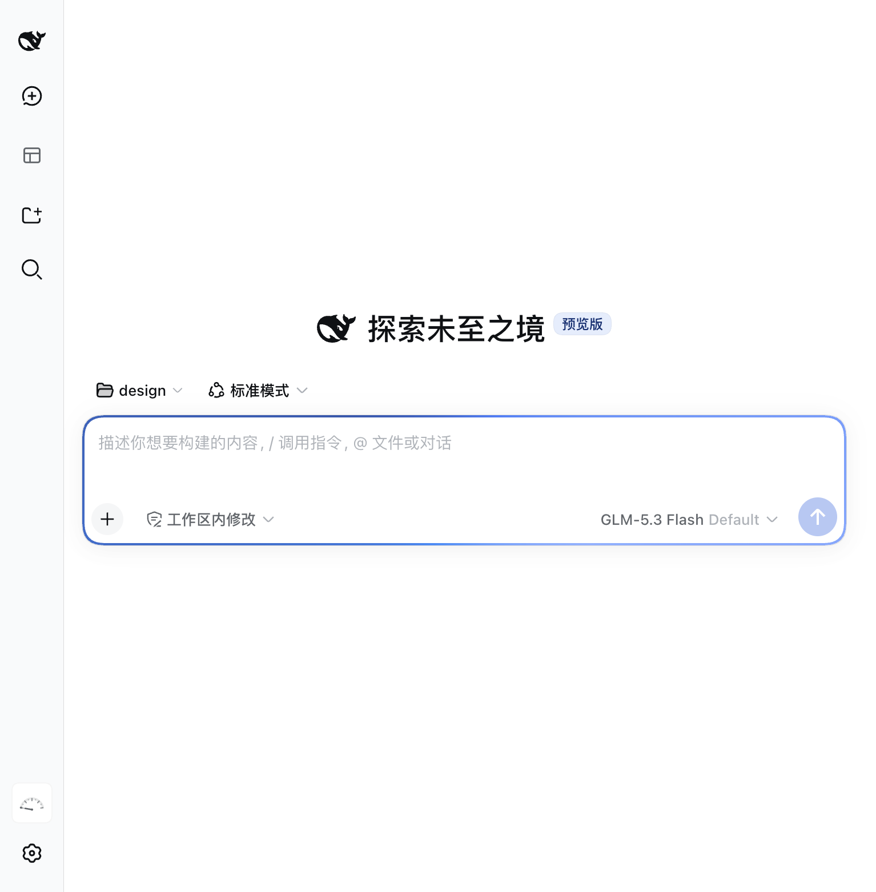

<div align="center">

# dsh-ui-rainbowspeak

<p align="center"><b>RainbowSpeak</b> (虹语) — a flowing rainbow border for the chat composer: the input box has moods — faster while running, amber while waiting, red on failure.</p>

<p align="center">
  <a href="https://github.com/kenz1117/dsh-ui-rainbowspeak/stargazers"></a>
  <a href="https://www.npmjs.com/package/@kenz1117/dsh-ui-rainbowspeak"></a>
  <a href="https://www.npmjs.com/package/@kenz1117/dsh-ui-rainbowspeak"></a>
  <a href="https://github.com/kenz1117/dsh-ui-rainbowspeak/blob/main/LICENSE"></a>
  <a href="https://github.com/kenz1117/dsh-ui-rainbowspeak/pulls"></a>
  <a href="https://github.com/kenz1117/dsh-ui-rainbowspeak"></a>
  <a href="https://github.com/kenz1117/dsh-ui-rainbowspeak/graphs/contributors"></a>
  <a href="https://awesome-dsh-plugin.com"></a>
</p>

[中文](README.md) · [English](README.en.md)

</div>

---

<div align="center">
  
</div>

## ✨ Why this one

### Pure decoration, zero intrusion

No slots taken over, no host patches, no tools registered, no system-prompt injections. Pure browser-side decoration: a `conic-gradient` ring masked down to the card edge, rotated by a registered custom property. 17 KB client bundle; engines without `@property` degrade to a static gradient ring.

### The border is the session state

The ring mirrors the live session: it speeds up while the agent is running (4 s → 1.2 s per loop), turns amber with a slow pulse while a tool approval or ask-user prompt is pending, turns red with a fast pulse on send failures or agent errors, and plays a one-loop celebrate flash when a turn completes. You always know where the agent is without watching the screen.

### Seven palettes, one that follows your theme

Classic rainbow / aurora / sunset / peach / ocean / cyberpunk neon — plus *follow theme*, derived from the host brand token via `color-mix`, tracking light/dark switches instantly.

## 🌈 Features

- **Rainbow marquee border** around the composer card (`[data-composer-card]` host anchor), flowing via a registered `@property` angle so the gradient genuinely animates. Engines without `@property` degrade to a static gradient ring.
- **Settings panel** (`Settings` → `Rainbow border`): enable/disable, flow speed (1–10 s per loop), ring width (1–6 px), color scheme, placement (all sides / top / bottom), reverse flow, and a breathing brightness overlay. All preferences persist in `localStorage` and apply live.

  
- **Seven color schemes**: classic rainbow, aurora, sunset, peach, ocean, cyberpunk neon (cyan/violet/magenta with a white lamp-flash segment), and *follow theme* — derived from the host brand token via `color-mix`.
- **Session-state awareness** via the host dock seat: the ring speeds up while the agent is running (4 s → 1.2 s per loop), turns amber with a slow pulse while a tool approval or ask-user prompt is pending, turns red with a fast pulse on send failures or agent errors, and plays a one-loop celebrate flash when a turn completes. Priority: error > attention > running.
- **Focus boost**: the ring brightens and saturates while the composer has focus, easing back on blur.
- **Accessibility**: honors `prefers-reduced-motion` (animations disabled, static ring kept); settings controls carry localized labels and aria attributes.
- **Bilingual copy** (zh/en) through the host locale registry; follows the host language setting.

## 🎨 Palettes

| Cyberpunk neon | Aurora | Sunset |
| --- | --- | --- |
|  |  |  |

**Follow theme** (light mode): the ring takes the host brand color and tracks theme switches instantly.



## 📦 Install

From the dsh CLI:

```sh
dsh plugin add @kenz1117/dsh-ui-rainbowspeak
```

Or add it to a profile `package.json` manually:

```json
{
  "dependencies": {
    "@kenz1117/dsh-ui-rainbowspeak": "*"
  }
}
```

For local development, point the dependency at a checkout:

```json
{
  "dependencies": {
    "@kenz1117/dsh-ui-rainbowspeak": "link:/absolute/path/to/dsh-ui-rainbowspeak"
  }
}
```

then run `pnpm install` in the profile directory and restart the host. With the `link:` form, `pnpm bundle` in the plugin repo is enough for the next host restart to pick changes up — no reinstall needed.

## ⚙️ How it works

- The plugin mounts a single `<style data-plugin>` stylesheet on apply and removes it on dispose (effect lifecycle).
- `::before` on the composer card paints a `conic-gradient` covering the full color wheel; a `mask` composite cuts out the interior so only the edge band remains, rounded to the card radius. Ring width and flow period are consumed from `--dsh-rainbow-*` variables.
- `--dsh-rainbow-angle` is registered as `<angle>` via `@property`, which is what makes the gradient's start angle interpolable; the keyframes rotate it 360°.
- User preferences and session state are projected onto `<html>` as `data-rainbow-*` attributes and inline CSS variables, so every toggle applies instantly without rebuilding the stylesheet.
- The state bridge reads the host session seat and the global pending-interaction seat (approval/ask-user) — plugin-level only, no agent-loop involvement.

## 🛠 Development

```sh
pnpm install        # deps (peers link into the monorepo checkout via scripts/link-peers.mjs)
pnpm test           # vitest suite (node half, preferences clamping, state projection, bundle smoke)
pnpm typecheck      # tsc --noEmit
pnpm bundle         # tsdown: lib/index.js (node half) + lib/client.js (browser IIFE)
```

The `client` half is a self-contained IIFE injected into the host web client; the `node` half is an empty carrier kept for manifest symmetry.

## 🤝 Compatibility

- Client platform: `web` (desktop/web host renders). Requires `@property` support for the flowing animation (all Chromium/Electron builds fine); other engines show a static ring.
- Peer: `@deepseek-ai/cordis` (provided by the host at runtime).

## 📄 License

[MIT](https://github.com/kenz1117/dsh-ui-rainbowspeak) © 2026 KenZ (kenz1117)
